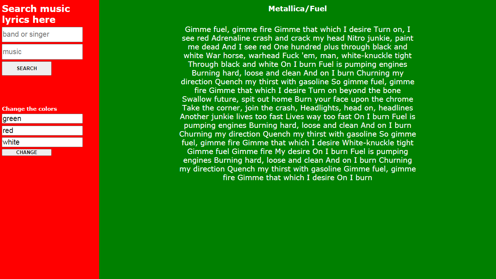

<h1 align='center'>Lyrics Search</h1>

  <h3>About</h3>
  
It is a simple website where the user searches for a band or singer and the name of the song and receives the lyrics.

  <h3>Used Tools</h3>
  <table>
    <tr>
      <td>Lyrics API</td>
      <td>Javascript</td>
      <td>HTML</td>
      <td>CSS</td>
    </tr>
  </table>

  

